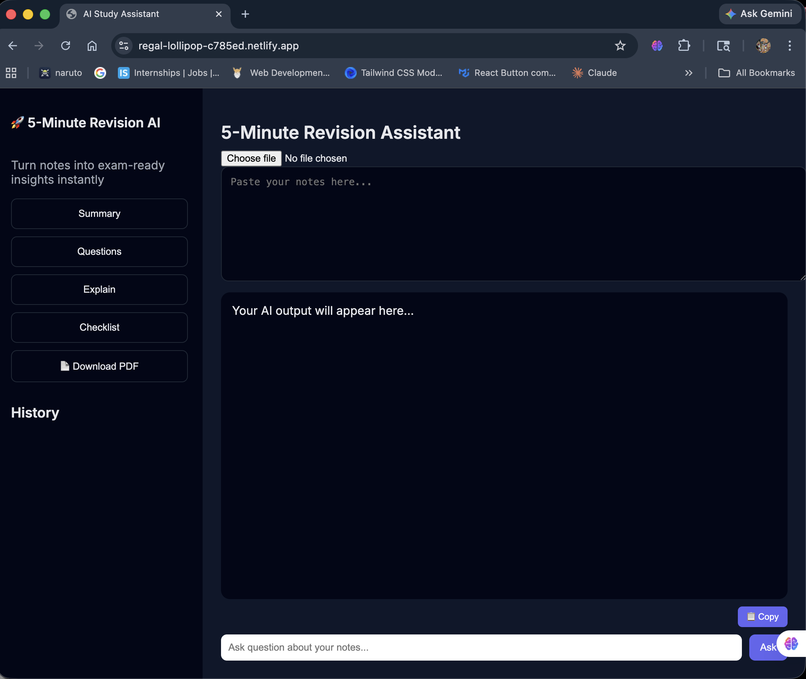

# AI Revision Assistant

Smart AI-powered tool that converts raw notes into exam-ready insights like summaries, questions, and explanations.

📌 Problem Statement

Students often struggle to revise large amounts of notes before exams.
Going through lengthy material is time-consuming and inefficient, especially during last-minute revision.

💡 Solution

AI Revision Assistant helps students convert raw notes into:
	•	Quick summaries
	•	Important exam questions
	•	Simple explanations
This allows faster and more effective revision in limited time.

🎯 Why I Built This

I built this project to:
	•	Solve my own revision problems
	•	Explore how AI can improve learning efficiency
	•	Gain hands-on experience with real-world API integration

## ✨ Features

- 📄 Summarize long notes into concise points  
- ❓ Generate important exam questions  
- 🧠 Explain complex concepts in simple terms  
- ✅ Create revision checklists  
- 💬 Chat with your notes  
- 📂 Upload `.txt` files  
- 📥 Download output as PDF  
- 🕘 View history of previous results  
  
## 🛠 Tech Stack

- HTML, CSS, JavaScript  
- Google Gemini API *(via backend – recommended)*  
- html2pdf.js  

## 🌐 Live Demo  

👉 https://regal-lollipop-c785ed.netlify.app

## 📸 Screenshots



## 📂 Project Structure

```bash
ai-revision-assistant/
├── index.html
├── style.css
├── script.js
├── screenshot.png
└── README.md
```

🚀 Setup & Usage

1. Clone the repository
```bash
git clone https://github.com/your-username/ai-revision-assistant.git
cd ai-revision-assistant
```
2. Run the app
	•	Open index.html in your browser
OR
	•	Use Live Server (recommended)

🔐 API Key Setup (Important)

⚠️ Do NOT add your API key directly in script.js for production.
For Local Testing Only:
	•	Open script.js
	•	Replace:
```bash
  const API_KEY = "YOUR_API_KEY_HERE";
```
For Production (Recommended)

To keep your API key secure:
	•	Use a backend (Node.js or Netlify Functions)
	•	Store the API key on the server
	•	Make API requests through your backend instead of directly from the browser
This prevents unauthorized usage and keeps your application secure.

